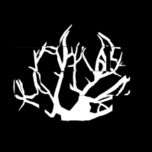

# TTTS Reinforcement learning
This repository contains two custom made gymnasium enviroments for training an agent in navigating and mapping placenta enviroment. Also there are scripts for training agents to perform defined tasks.

## Environment v0
Environment v0 is a simple grid enviroment. Agent is tasked with discovering whole grid world. Agent is a camera that has a viewport, every grid cell that is inside the viewport changes value from 0 to 1. 

- ### Observations
    After each step agent observes its position in grid. Cells inside viewport change their values. Default viewport dimensions 3x3 wiith 9x9 grod world.

- ### Actions
    Agent has 4 defined actions: 
    - UP
    - DOWN
    - LEFT
    - RIGHT

    Every time action is decided agent takes a step in the decided direction with a defined step_size. Default step_size is 1.

- ### Rewards
    Agents task is to discover whole grid world, when it achives the goal episode is terminated and final reward is given.
    Aditionally agent receives reward for the amount of discovered cells in each step. To motivate agent to move and discover new areas there is a small penalty for taking a step. 
    [Here table with rewards]

- ### Reinforcement Learning
    Agent is learning a policy using Q-Learning with epsilon greedy strategy. 
    [Here pic of q learning algorith,]

## Environment v1
Environment v1 is more complicated than v0. Instead of grid world agent moves its viewport on the placenta segmentation image. Every time agent discovers new area it mapps all white pixels (vessels) into its map in memory.

- ### Observations
    After each step agent observes part of placenta image that fits inside its viewport. Captured viewport is saved to map inside memory. Default viewport dimensions 256x256.

- ### Actions
    Agent has 4 defined actions: 
    - UP
    - DOWN
    - LEFT
    - RIGHT

    Every time action is decided agent takes a step in the decided direction with a defined step_size. Default step_size is 64.

- ### Rewards
    Agents task is to discover most of white pixels (90%) in the segmented image, when it achives the goal episode is terminated and final reward is given.
    Aditionally agent receives reward for the amount of discovered white pixels in each step. To motivate agent to move and discover new areas there is a small penalty for taking a step. 
    [Here table with rewards]

- ### Reinforcement Learning
    Agent is learning a policy using Deep Q-Learning (DQL) with 2 custom convolutional neural networks (CNN). 
    [Here pic of architecture of network]

    #### Hyperparameters
    - learning_rate = 0.001
    - gamma = 0.9  (discount rate)
    - network_sync_rate = 10   (number of steps the agent takes before syncing the policy and target network)
    - replay_memory_size = 1000  (size of replay memory)
    - mini_batch_size = 32  (size of the training data set sampled from the replay memory)

## Run Training

`python3 v1/v1_camera_train_dqn.py` - for training using custom dqn implementation

`python3 v1/v1_sb3.py` - for training using SB3 dqn implementation

`python3 v2/sb3_train.py` - for training using SB3 dqn implementation

`python3 v2/dqn_train.py` - for training using SB3 dqn implementation

## Tests

To run tests on the environment V2 with the PPO algorithm:
`python3 v2/test.py` 

[Watch mapping demo](media/trained_agent.gif)

Result of RL mapping using PPO algorithm:

## Requirements
- Gymansium
- pyTorch
- Stable Baselines3
